## Send email when google sheet is edited

Suppose you're a school teacher and you're planning an upcoming Parent-Teacher conference. Instead of using a printed sign up sheet, you decide to use a Google Sheets spreadsheet where parents can sign up for a meeting slot.
## What you will build in this tutorial
First, you will create a spreadsheet where parents can sign up for a slot.

Next, you will create a HTML email template and write some Apps Script code to send out emails.

Finally, you will automate sending this email notification whenever your spreadsheet is edited by a parent.

Below is a screenshot of the email you'll receive whenever a parent signs up for a slot. The email includes all of the information in the spreadsheet and it highlights the row that was edited

##Prerequisites
This tutorial assumes that you are reasonably familiar with Google Sheets and Google Apps Script. In particular, it assumes that you know:

Basic coding concepts and ideally some familiarity with JavaScript.

How to create a Google Apps Script?

How to send email from Google Sheets?

How to send HTML email from Google Sheets?

What are Triggers and when to use them?
##Five steps to begin sending an email notification whenever your Google Sheets spreadsheet is edited.

Step 1: Create your spreadsheet.

Step 2: Create a script that will send out the email notification.

Step 3: Set up a trigger to run your script whenever your spreadsheet is edited.

Step 4: Confirm that emails are sent whenever your spreadsheet is edited.

Step 5: Create an HTML email to make the notification more useful
##Step 1 — Create a Google Sheets spreadsheet where parents can sign up for a meeting slot.
Create a sheet containing three columns: Teacher, Time slot and Child name. Since the class has two teachers and twelve kids, you decide to create six 25-minute long slots between 10:00 AM and 1:00 PM with 5-minute breaks in-between slots. Delete all the rows and columns in the spreadsheet that you will not be using.

Parents can sign up for a slot by entering their child's name in the third column (Column C).
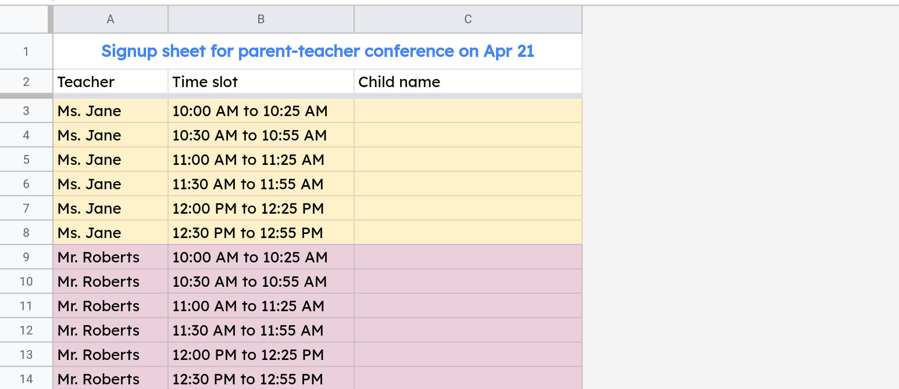
## Step 2 — Create an Apps Script function that will send out email notifications
Step 2.1 — Create the script
Open the Script editor by selecting Tools —> Script editor and replace the code in the editor with the code below.
⚠ Please replace the email address in the code snippet below with your email address.

## ![Code.gs]

How does the above code work?
The processEdit() function will be run (by the trigger that you'll be setting up shortly) whenever your spreadsheet is edited.

The argument e is an object containing information about the edits that were made. For example, its range property will tell you the cell (or the range) that was edited.

The function body uses the MailApp object to send an email.

The //@OnlyCurrentDoc annotation tells Apps Script that you only want your script to get access to this spreadsheet and not your other files in Google Drive.
##Step 2.2 — Test your script by running it
Step 2.2.1 — Click the run button (play icon) to run the processEdit function.
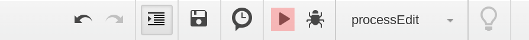
## Step 2.2.2 — Authorize your script

Apps Script will ask you to authorize your script. Click Review Permissions to continue.

You might be asked to select a Google Account if you are signed into multiple accounts.
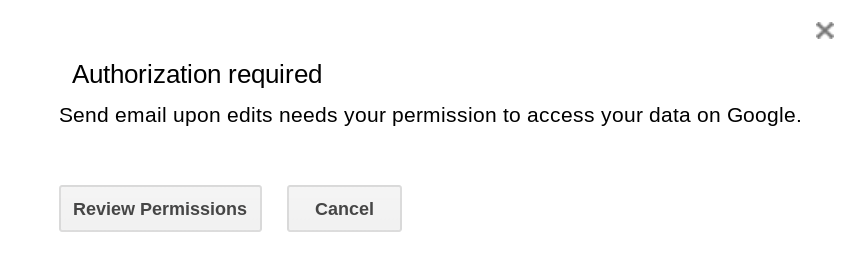
Google will warn you that your app isn't verified. Whenever you see this warning, you should only proceed if you trust the developer that created the script. In this case, you are the developer so it is fine to proceed. Click Advanced to continue.
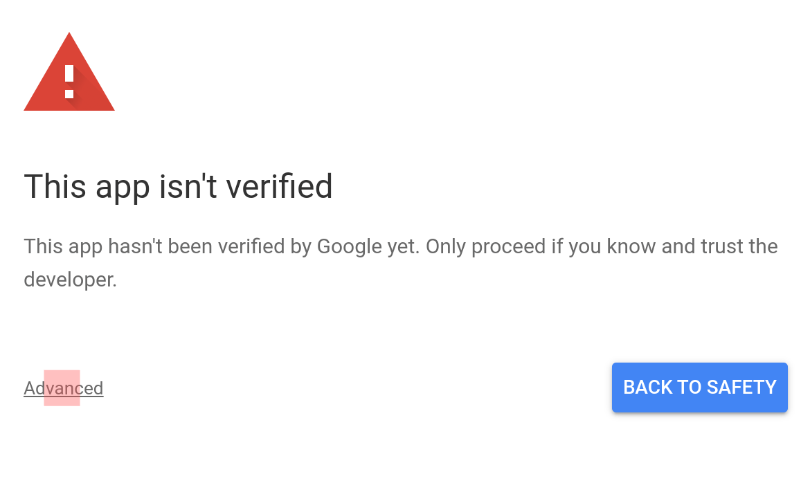
Click the link at the bottom (i.e., the one called Go to <your script's name> ...) to continue.

Review the permissions carefully and assuming you're OK with granting these permissions, click Allow to complete the authorization process.

In this case, the script needs two permissions:

It needs to be able to access the spreadsheet it is installed in (i.e,. the spreadsheet you created in step 1).

It needs to be able to send emails.
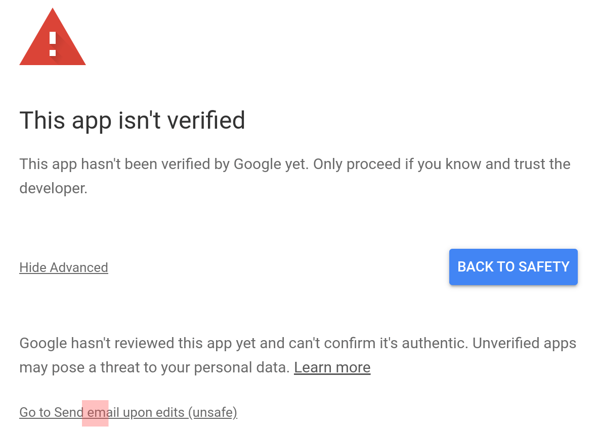
## Step 2.3 — Check if you received the notification email
Check your email inbox. If you're script ran successfully, you should receive an email like the one below.
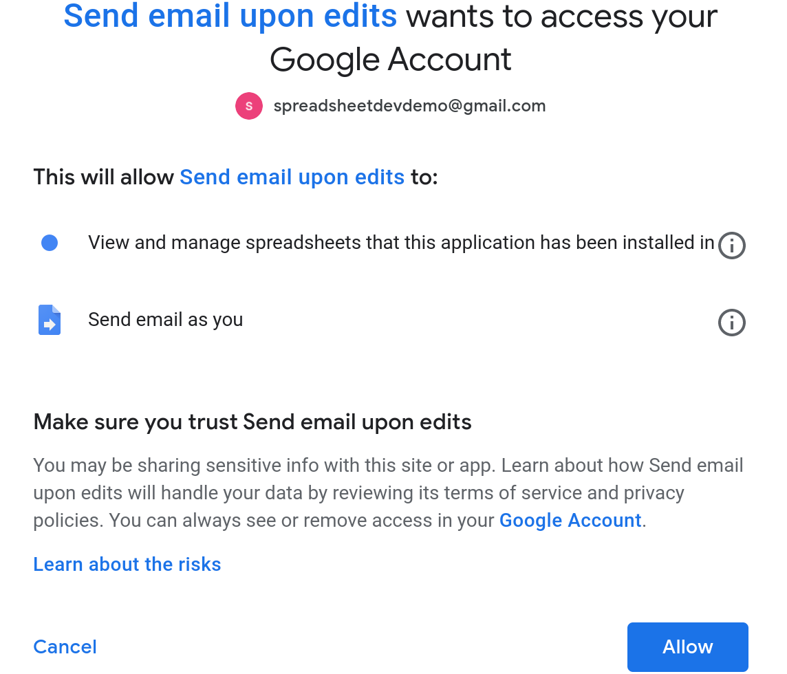

## Step 3 — Set up a Spreadsheet Trigger to run your script whenever the spreadsheet is edited
So far you've created a script that will send out emails whenever you run it. The next step is to make it send out emails automatically.

A trigger is a feature in Google Apps Script that will automatically run your script whenever a specific event occurs in your spreadsheet.

If you'd like to learn more about triggers, I've written a detailed article on Triggers in Google Sheets.

We'll create an Installable Spreadsheet Trigger to run the processEdit() function whenever your spreadsheet is edited.
## Step 3.1 — Click the clock button to open the Triggers page
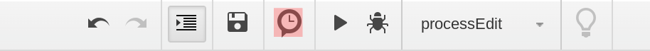
## Step 3.2 — Click + Add Trigger to create a new trigger
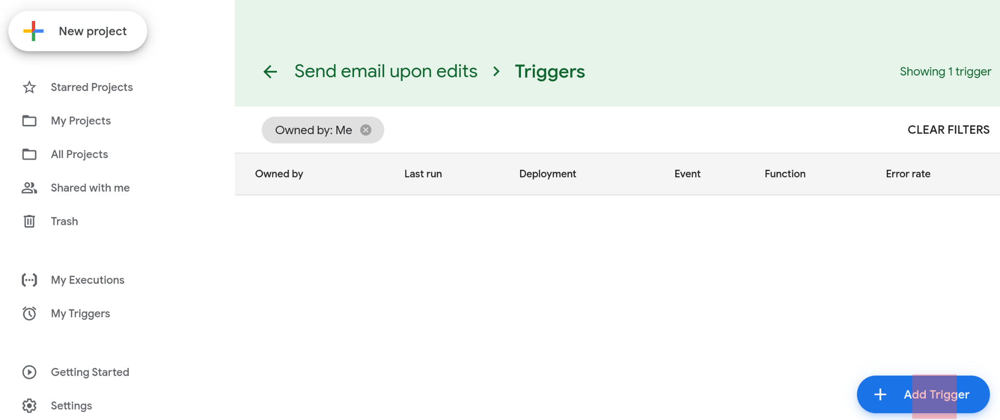
## Step 3.3 — Configure the trigger
Choose the following settings to configure your trigger correctly:

Function to run: processEdit

Deployment: Head

Event source: From spreadsheet

Event type: On edit

Then click Save to create the trigger
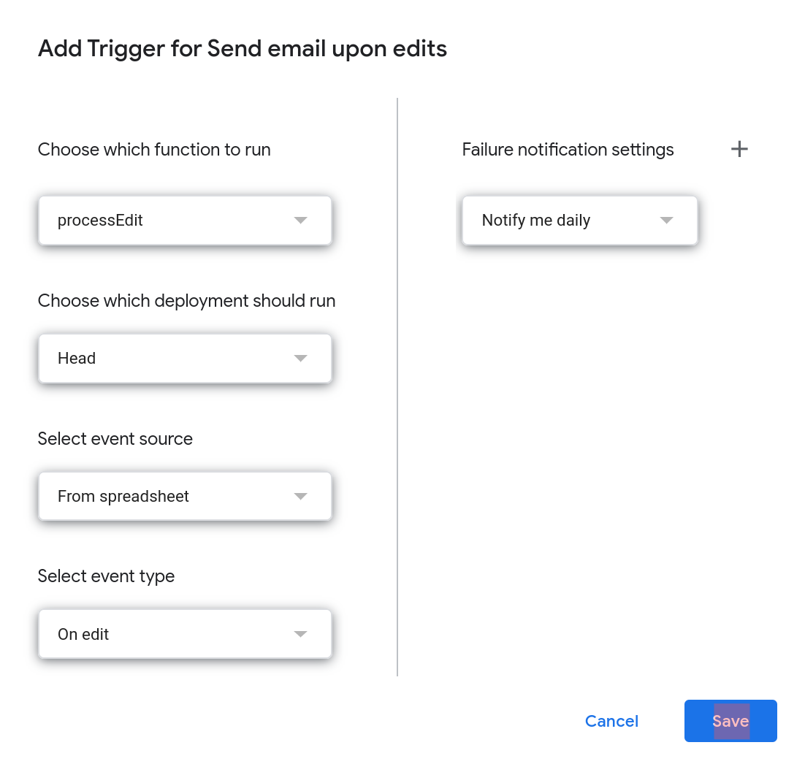
## Step 3.4 — Authorize your script to run automatically
When you click Save, you might be asked to authorize your script again and grant it additional permissions. In particular, your script will now need permission from you "to run when you are not present". Once you click Allow, the trigger will be created.
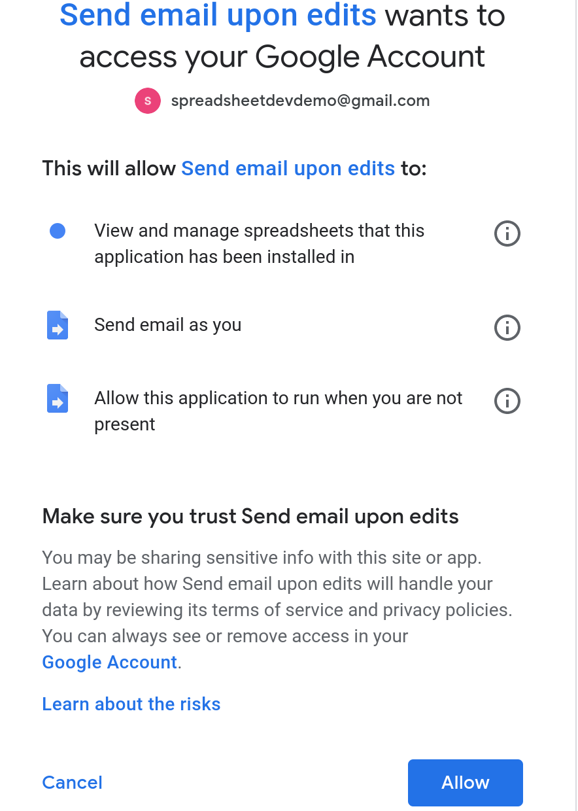
## Step 3.5 — You're done! Confirm that your new trigger is listed on the Triggers page
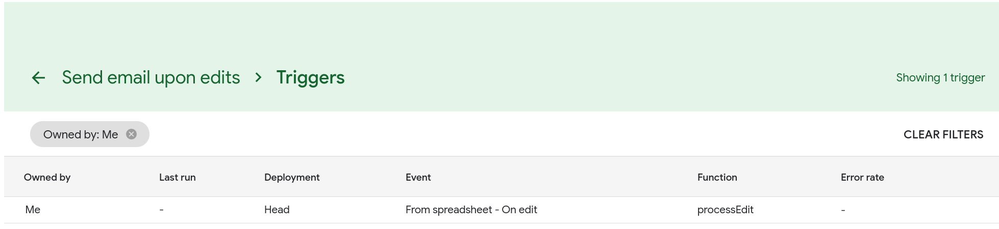
## Step 4 — Confirm that emails are sent to you whenever your spreadsheet is edited
Edit your spreadsheet and confirm that you're receiving email notifications like the one below.

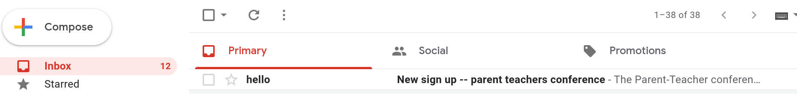
If it worked, you've successfully set up automated email notifications whenever your spreadsheet is edited. Congratulations!
## Step 5 — Convert your email to a HTML template to highlight the changes that were made in the Spreadsheet
The notification will be more useful if it told you what was edited in your spreadsheet.
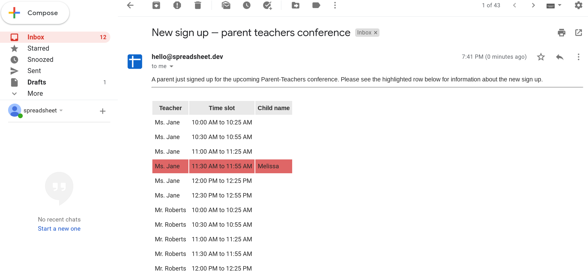
To implement these changes, you need to first create a HTML template for the email and then modify your script to use this template.
## Step 5.1 — Create a HTML template
Step 5.1.1 — Create a HTML file
Select File —> New —> HTML file from the menu bar
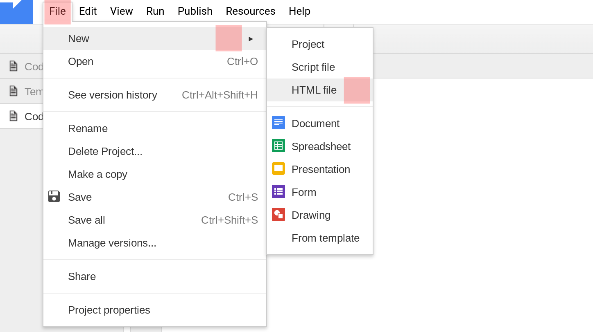
Enter Template.html as the name of your file.
## Step 5.1.2 — Replace the contents of Template.html with the HTML code below
A parent just signed up for the upcoming Parent-Teachers conference. Please see the highlighted row below for information about the new sign up.

 
<table cellpadding='5'>
  <tr>
    <th bgcolor='#eaeaea'><?= headerRow[0] ?></th>
    <th bgcolor='#eaeaea'><?= headerRow[1] ?></th>
    <th bgcolor='#eaeaea'><?= headerRow[2] ?></th>
  </tr>
  <? var rowIndex = 3; ?>
  <? for(var i = 0; i < rows.length; i++) { ?>
  <?   var background = rowIndex === editedRow ? "#e06666" : "#ffffff";  ?>
  <tr>
    <td bgcolor='<?= background ?>'><?= rows[i][0] ?></td>
    <td bgcolor='<?= background ?>'><?= rows[i][1] ?></td>
    <td bgcolor='<?= background ?>'><?= rows[i][2] ?></td>
  </tr>
  <?    rowIndex = rowIndex + 1; ?>
  <? } ?>
</table>
## Step 5.2 — Create a named range to make it easy for your code to access the information in the sign up sheet
Select the range A2:C:14 since this is the information that you'll be including in the email as a HTML table.

The code we'll write in the next step assumes that the first row in this range is a header row. If you do not have a header row in your sheet, you'll have to modify the code accordingly.
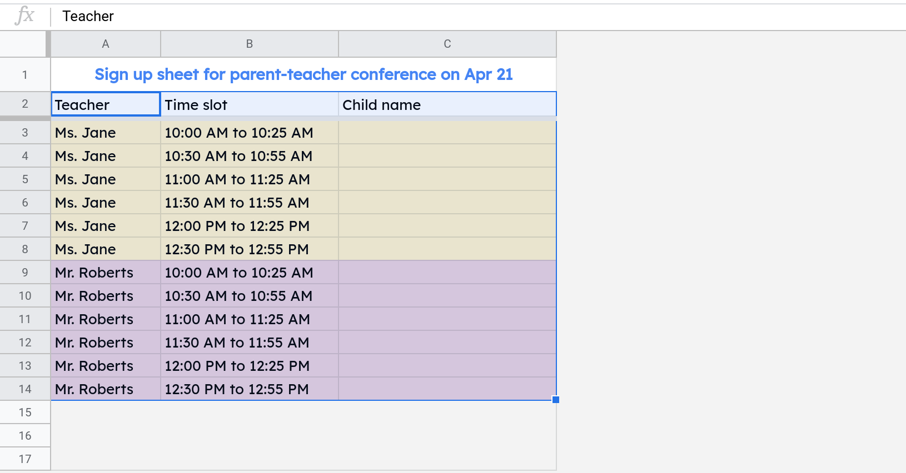
With the range selected, right click and select Define named range from the menu.
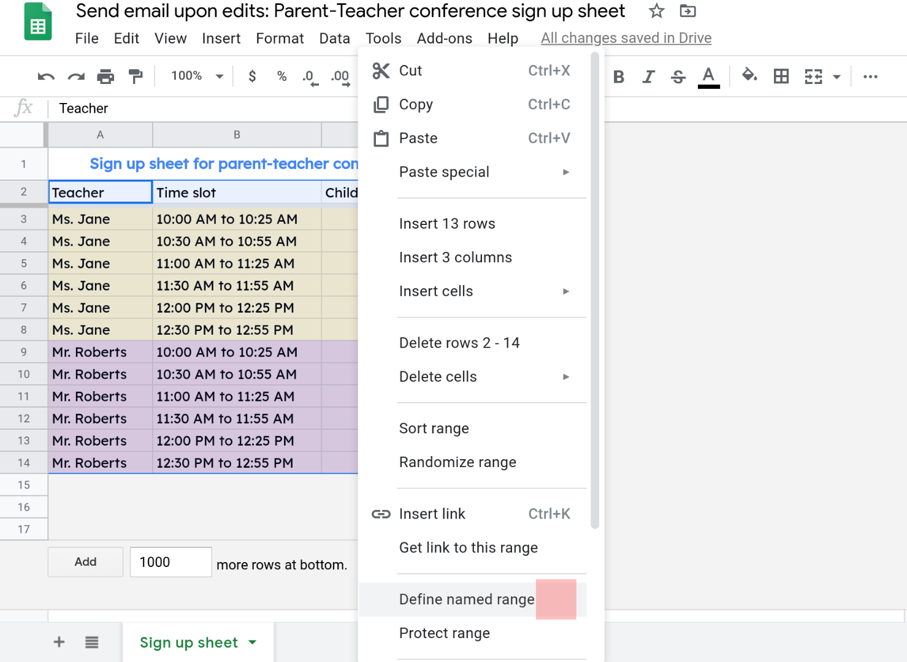
Enter "signups" as the name of your range and click Done to create a named range.

You should see the named range displayed in the sidebar.
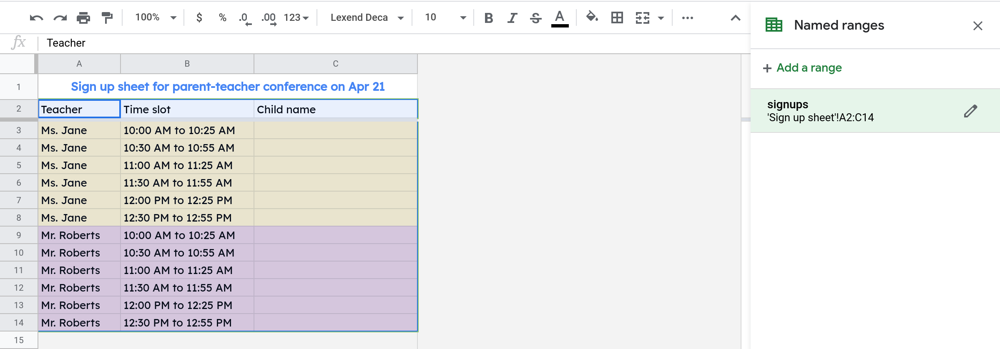
## Step 5.3 — Modify your script to use the HTML template
⚠ Please replace the email address in the code snippet below with your email address.
##
//@OnlyCurrentDoc
function processEdit(e) {
  var sheet = SpreadsheetApp.getActive();
  var rows = sheet.getRangeByName("signups").getValues();
  var headerRow = rows.shift();
  var editedRow = e.range.getRow();
  
  var template = HtmlService.createTemplateFromFile("Template");
  template.headerRow = headerRow;
  template.editedRow = editedRow;
  template.rows = rows;
  
  var html = template.evaluate().getContent();
  
  MailApp.sendEmail({
    to: "youremail@example.com",
    subject: "New sign up -- parent teachers conference",
    htmlBody: html
  });
}
## Step 5.3 — Test your shiny new email template
Instead of receiving an email that only tells you something was edited, you'll now receive an email that shows you exactly what was edited.
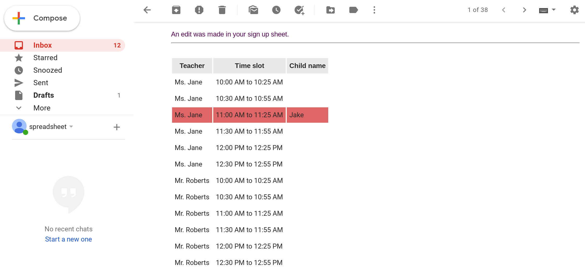
